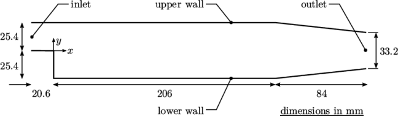

## What is blockMesh?

`blockMesh` is OpenFOAM's built-in structured mesh generator. Instead of importing a mesh
from an external tool, you describe the geometry and topology of your mesh directly inside
a plain-text dictionary file called `blockMeshDict`, located at:

```
<case>/system/blockMeshDict
```

`blockMesh` reads this file and writes the resulting mesh into `<case>/constant/polyMesh/`.
The mesh is made up of **hexahedral blocks** — each block has eight vertices, twelve edges,
and six faces. You can join multiple blocks together to represent more complex shapes. Generation of the mesh can be done by typing `blockMesh` in the shell. There are multiple variants of structured grid as well, O-grid and H-Grid to name a couple. These grids are useful when dealing with circular geometry like pipes and aerofoils. 

---

## pitzDaily `blockMeshDict` 

pitzDaily `blockMeshDict` from OpenFOAM tutorial is shown below.
Image below is from [OpenFOAM document](https://doc.cfd.direct/openfoam/user-guide-v13/backwardstep) 



```cpp
/*--------------------------------*- C++ -*----------------------------------*\
  =========                 |
  \\      /  F ield         | OpenFOAM: The Open Source CFD Toolbox
   \\    /   O peration     | Website:  https://openfoam.org
    \\  /    A nd           | Version:  13
     \\/     M anipulation  |
\*---------------------------------------------------------------------------*/
FoamFile
{
    format      ascii;
    class       dictionary;
    object      blockMeshDict;
}
// * * * * * * * * * * * * * * * * * * * * * * * * * * * * * * * * * * * * * //

// Note: this file is a Copy of $FOAM_TUTORIALS/resources/blockMesh/pitzDaily

convertToMeters 0.001;

vertices
(
    (-20.6 0 -0.5)
    (-20.6 25.4 -0.5)
    (0 -25.4 -0.5)
    (0 0 -0.5)
    (0 25.4 -0.5)
    (206 -25.4 -0.5)
    (206 0 -0.5)
    (206 25.4 -0.5)
    (290 -16.6 -0.5)
    (290 0 -0.5)
    (290 16.6 -0.5)

    (-20.6 0 0.5)
    (-20.6 25.4 0.5)
    (0 -25.4 0.5)
    (0 0 0.5)
    (0 25.4 0.5)
    (206 -25.4 0.5)
    (206 0 0.5)
    (206 25.4 0.5)
    (290 -16.6 0.5)
    (290 0 0.5)
    (290 16.6 0.5)
);

negY
(
    (2 4 1)
    (1 3 0.3)
);

posY
(
    (1 4 2)
    (2 3 4)
    (2 4 0.25)
);

posYR
(
    (2 1 1)
    (1 1 0.25)
);


blocks
(
    hex (0 3 4 1 11 14 15 12)
    (18 30 1)
    simpleGrading (0.5 $posY 1)

    hex (2 5 6 3 13 16 17 14)
    (180 27 1)
    edgeGrading (4 4 4 4 $negY 1 1 $negY 1 1 1 1)

    hex (3 6 7 4 14 17 18 15)
    (180 30 1)
    edgeGrading (4 4 4 4 $posY $posYR $posYR $posY 1 1 1 1)

    hex (5 8 9 6 16 19 20 17)
    (25 27 1)
    simpleGrading (2.5 1 1)

    hex (6 9 10 7 17 20 21 18)
    (25 30 1)
    simpleGrading (2.5 $posYR 1)
);

boundary
(
    inlet
    {
        type patch;
        faces
        (
            (0 1 12 11)
        );
    }
    outlet
    {
        type patch;
        faces
        (
            (8 9 20 19)
            (9 10 21 20)
        );
    }
    upperWall
    {
        type wall;
        faces
        (
            (1 4 15 12)
            (4 7 18 15)
            (7 10 21 18)
        );
    }
    lowerWall
    {
        type wall;
        faces
        (
            (0 3 14 11)
            (3 2 13 14)
            (2 5 16 13)
            (5 8 19 16)
        );
    }
    frontAndBack
    {
        type empty;
        faces
        (
            (0 3 4 1)
            (2 5 6 3)
            (3 6 7 4)
            (5 8 9 6)
            (6 9 10 7)
            (11 14 15 12)
            (13 16 17 14)
            (14 17 18 15)
            (16 19 20 17)
            (17 20 21 18)
        );
    }
);

// ************************************************************************* //
```

---

## Line-by-line explanation

---

### FoamFile

```cpp
FoamFile
{
    format      ascii;
    class       dictionary;
    object      blockMeshDict;
}
```

Every OpenFOAM dictionary begins with a `FoamFile` sub-dictionary.
OpenFOAM reads this to identify the file before parsing the rest.

| Key | Meaning |
|---|---|
| `format` | `ascii` (human-readable) or `binary` (faster for large meshes). |
| `class` | The C++ class that will parse this file. `dictionary` is used for all text config files. |
| `object` | The name of the file — must match the actual filename (`blockMeshDict`). S|

---

### scale

```cpp
scale   0.001;
```

A global scaling factor applied to **every** vertex coordinate.
Use `scale 1` if your coordinates are in meters and you want metres,
or `scale 25.4` to convert inches to millimetres (combined with a unit system).

---

### vertices

```cpp
vertices
(
    (0   0   0  )   // 0 — back-bottom-left
    (1   0   0  )   // 1 — back-bottom-right
    ...
);
```

A list of 3-D coordinates that define the corners of your blocks.
Each vertex is referenced later by its **zero-based index** (the first vertex
listed is vertex 0, the second is vertex 1, and so on).

> **Tip:** Add a comment on each line with the index and a human-readable label.
> Debugging is much harder without them.

---

### blocks

```cpp
blocks
(
    hex (0 1 2 3 4 5 6 7)
        (20 1 1)
        simpleGrading (1 1 1)
);
```

This is where you define the topology — how the vertices connect into hexahedral
(six-face) blocks.

| Part | Meaning |
|---|---|
| `hex` | Block shape: hexahedron. This is the only supported type in most OpenFOAM versions. |
| `(0 1 2 3 4 5 6 7)` | The eight vertex indices of this block, listed in the right-hand-rule order (see diagram below). |
| `(20 1 1)` | Number of cells in the **x**, **y**, **z** directions of this block. |
| `simpleGrading (1 1 1)` | Cell size ratio between the last and first cell in each direction. `1` = uniform spacing. Use `> 1` to cluster cells towards the end of an edge. |

**Vertex ordering inside a block:**

```
    7 ---- 6
   /|     /|
  4 ---- 5 |
  | 3 ---| 2
  |/     |/
  0 ---- 1
```

Vertices 0–3 form the "back" face (lower z), vertices 4–7 form the "front" face
(higher z). The ordering must follow the **right-hand rule** so that
face normals point outward — getting this wrong produces negative-volume cells.

---

### edges

```cpp
edges
(
);
```

Optional curved edges. If left empty (as here), all edges are straight lines
between vertices. You can use `arc`, `spline`, or `polyLine` entries here to
create cylindrical or arbitrary-curve geometries.

---

### boundary

```cpp
boundary
(
    inlet
    {
        type patch;
        faces
        (
            (0 4 7 3)
        );
    }
    ...
);
```

Defines the named patches that appear in `0/` boundary conditions.
Each patch needs:

| Key | Meaning |
|---|---|
| `type patch` | Generic boundary — no special physics. Use for inlets, outlets, symmetry planes, etc. |
| `type wall` | Triggers wall functions in turbulence models. |
| `type empty` | Suppresses solution in that direction — required for 2-D simulations (one cell thick in z). |
| `type symmetryPlane` | Applies a symmetry condition. |
| `faces` | List of four vertex indices (in counter-clockwise order when viewed from outside) that define each face on this patch. |

> **Important:** Every face on the outer boundary of your mesh **must** appear in
> exactly one patch. Missing faces cause `checkMesh` to report open boundaries.
> Duplicate faces cause topology errors.

---

## Running blockMesh

From your case directory:

```bash
blockMesh
```

Then check the mesh quality:

```bash
checkMesh
```

Look for:
- **Max non-orthogonality** < 70° (ideally < 40°)  
- **Max skewness** < 4  
- Zero cells with negative volume

---

## Next steps

- **Grading**: Change `simpleGrading (4 1 1)` to stretch cells towards the outlet — useful for boundary layer resolution.
- **Multiple blocks**: Add more `hex` entries to the `blocks` list and share vertices at their interfaces.
- **Curved edges**: Use `arc` in the `edges` section to mesh cylinders.
