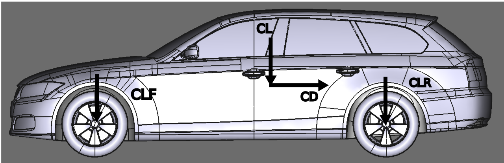

---

## Background

I was involved with the early development of Genesis Hypercar GR1. We used to call it GR1, but I guess the code name has changed to GMR01(Genesis Magma Racing?). Working with the Genesis design studio in Irvine I was able to guide the designers to consider FIA regulation, the aerodynamic balance and the efficiency of the vehicle. Much of the focus on the earlier days was on the asthetic not performance and I am quite happy see that the design of the vehicle has changed for the better. *Disclaimer, I am not a professional LMP1/LMH aero engineer and what has been written here can be inaccurate (hopefully not too much).

## Aerodynamic Efficiency and Balance

Aerodynamic efficiency refers to the ratio between lift ($C_{L}$) and drag ($C_{D}$), $C_{L}/C_{D}$ and it is a one of key metric to evaluate the performance of the vehicle. The value will change depending on the setup and the value will reflect on the nature of the circuit. 

The typical value of $C_{L}/C_{D}$ ranges from 2 - 4 for LMP1 vehicles.
+ At Le Mans, there is a lot of long stretches with striaght lines  which means that $C_{L}/C_{D}$ will be closer to 4 

+ At Bahrain, the course is a mixture of long straights and low speed corner so $C_{L}/C_{D}$ will be closer to 2 or 3 

Aerodynamic balance is the ratio between front lift ($C_{LF}$) and rear Lift ($C_{LR}$). There is a bit of a rear bias to aid in cornering for these kind of vehicles, but this value will also depend on the circuit. The target was not defined during the development, and I had to create my own target based on my previous experience as a FSAE aerodynamics team member. 

I decided the target to be:
+ $C_{L}/C_{D}$ = 3
+ $C_{LF}/C_{LR}$ = 1

At the end of the day, the real development will be done by the Magma team and my job was to ensure that they would not have to alter the geometry that much. 

---

## Aero Items
The items below were utilized to meet my self-imposed aero target, since the changes I could make to the exterior of the vehicle was very limited. I am what you call a "theme-breaker".
### Dive Planes & Splitter

---
### Diffuser

---
### Rear Wing

---
### Shark Fin

---

## Conclusion

---