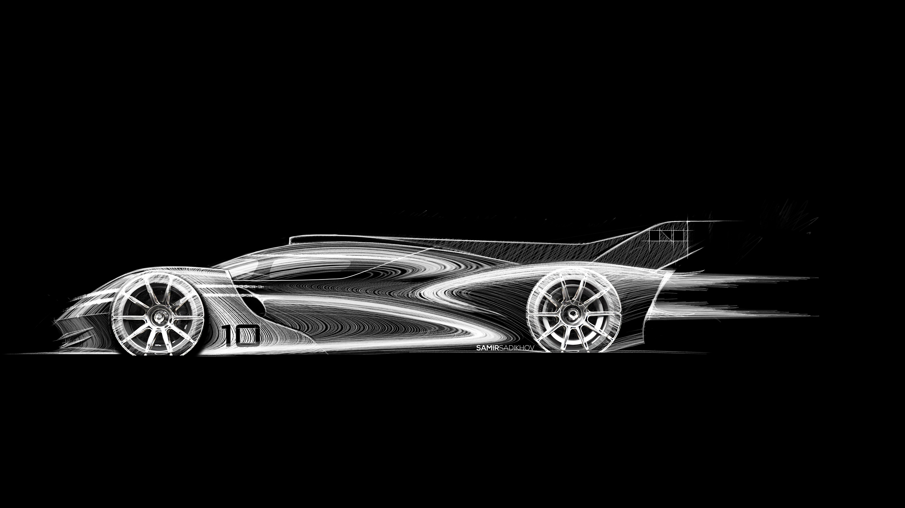

---

## Background

I was involved with the early development of Genesis Hypercar GR1. We used to call it GR1, but I guess the code name has changed to GMR01(Genesis Magma Racing?). Working with the Genesis design studio in Irvine I was able to guide the designers to consider FIA regulation, the aerodynamic balance and the efficiency of the vehicle. Although much of this work remains proprietary, I can discuss several key aspects where I had direct influence. I should make a disclaimer that I am not a professional LMH aero enginner and much of the work I did was based purely on online research.

## Aerodynamic Efficiency and Balance
Aerodynamic efficiency refers to the ratio between lift and drag, $L/D$ and it is a one of key metric to evaluate the performance of the vehicle. The value will change depending on the setup and the value will reflect on the nature of the circuit. 

The typical value of $L/D$ ranges from 2-4 for LMP1 vehicles.
+ At Le Mans, there is a lot of long stretches with striaght lines  which means that $L/D$ will be closer to 4 

+ At Bahrain, the course is a mixture of long straights and low speed corner so $L/D$ will be closer to 2 or 3 

I had no idea where this vehicle will be running, so I decided the target to be $L/D=3$.

---

## Aero Items
---
### Dive Planes & Splitter
---
### Diffuser
---
### Rear Wing
---
### Shark Fin
---

## Conclusion

---