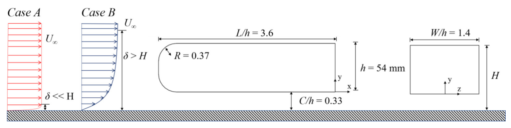

---

#### Description

I investigated the effect of approach flow condition on the wake of an Ahmed body. Two different case was considered, case A had an uniform inlet condition and a fully developed boundary layer was specified at the inlet for case B. Bimodal behaviour of the wake disappeared once a fully developed boundary layer was specified at the inlet. 

+ [Paper](Effects_of_approach_flow_conditions_on_t.pdf)

---

#### Flow condition

---
