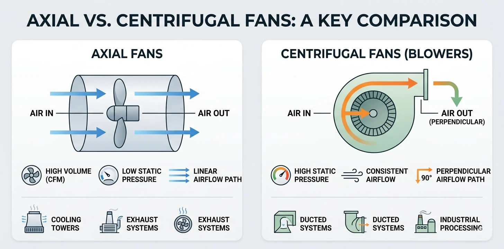
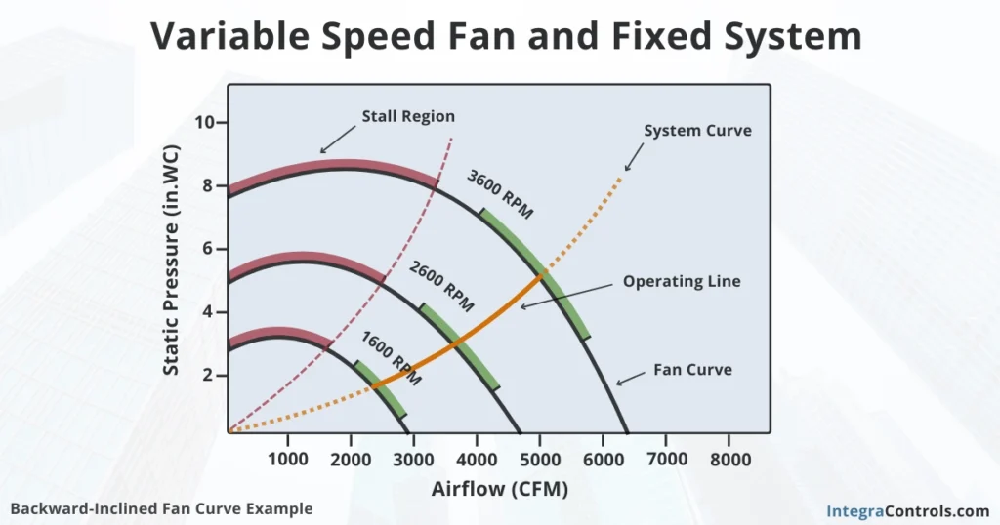

## Fans 
Two primary types of fan typically used are axial fan and centrifugal fan. They both move air, but centrifugal fans are more suitable for this project since it is designed to move high volume of air with greater resistance. Axial fans are commonly used to cool objects inside of an electronic or a car whereas centrifugal fans are oftentimes installed inside of a building to move air through a duct. Below is a figure summarizing the two obtained from [here](https://www.fansco.com/news/what-is-the-difference-between-centrifugal-and-axial-fan/).

### Fan Performance Curve
Each fan can be characterized using a fan performance curve which tells you how much air it can move given its RPM and static pressure. An in depth explanation regarding fans can be found [here](https://integracontrols.com/fan-curves-explained/) (The figure below is from there too).

As you can see from the figure, a separate fan curve must be made for each operation condition. The red region signifies the stall region where the fan is not operating as it was intended and flow is separating over the blade. Since I want to vary the air speed inside of the tunnel by an increment of 1 m/s, I would have to create a system curve using 10 different points in CFD. It is quite imperative that I approximate the static pressure as accurately as possible by including the effects of screen and honey comb when creating the **P vs CFM** graph. If I want to select the most appropriate fan for my tunnel. Once fan is selected, I can utilize the Fan affinity law to calculate my operational condition. Fan law states that:
1. Airflow is directly proportional to RPM, $$CFM_{2}=CFM_{1}\frac{RPM_{2}}{RPM_{1}}$$
2. Static Pressure changes quadratically with RPM, $$SP_{2}=SP_{1}(\frac{RPM_{2}}{RPM_{1}})^{2}$$
3. Brake Horse Power changes with the cube of RPM, $$BHP_{2}=BHP_{1}(\frac{RPM_{2}}{RPM_{1}})^{3}$$

