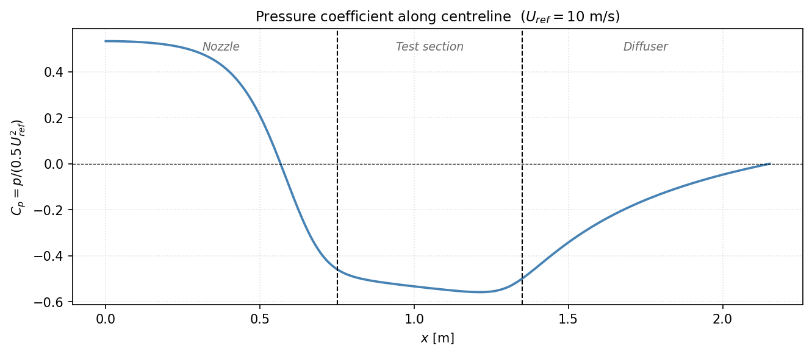
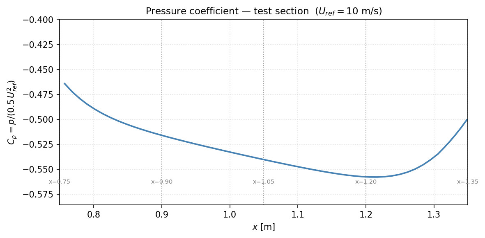
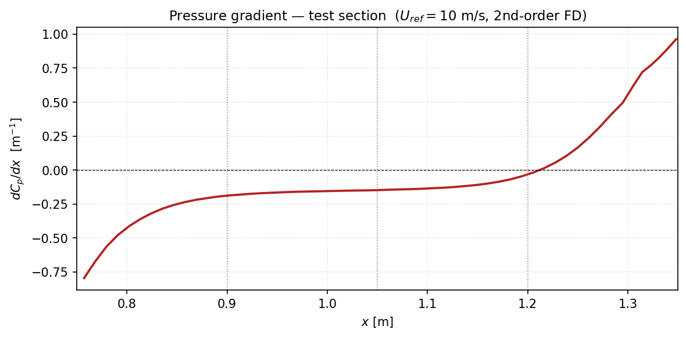
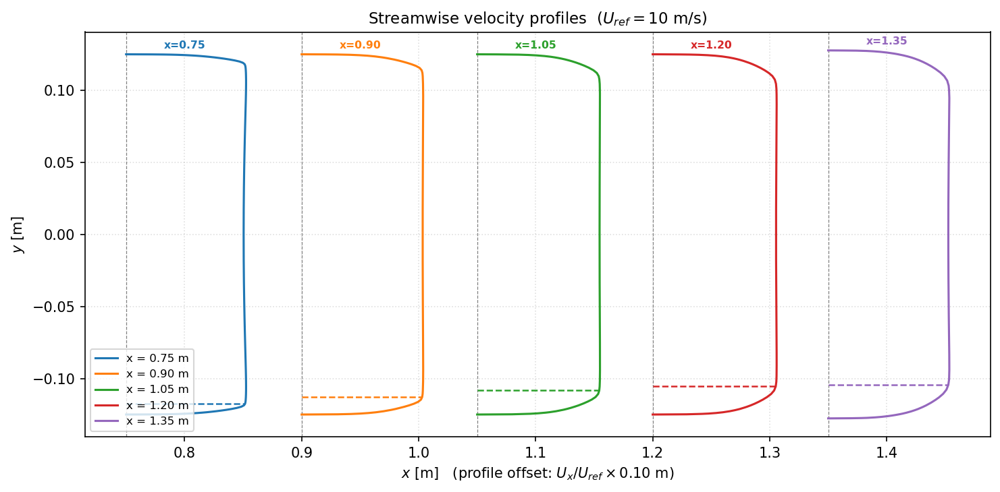

## Wind tunnel Physics

It is quite important to understand the characteristics of the wind tunnel in order to properly understand the result obtained from it. Knowing the flow field inside of the tunnel will also let me position sensors and test rigs in appropriate locations. For now I just employed RANS simulation using k-e turbulence model. Two variables that I looked into are streamwise velocity profiles and axial pressure distribution. 

The velocity profiles will let me understand how boundary layer grown from the tunnel may affect the result and also shed some light on how high the ground plane must be installed. Axial pressure gradient is also important since it will have direct impact on any force measured inside of the tunnel. 

I am only aware of the corrections they do for automotive tunnels which are oftentimes an open-jet tunnel. My tunnel will be a closed-jet tunnel so the blockage will have a greater influence on the model since the dynamic pressure will change more as air accelerates if the blockage is big enough. I will have to read up on how aerospace wind tunnels are operated since my knowledge is a bit limited. 

### Pressure Distribution

The figure above shows how pressure changes along the wind tunnel. It is what you expect, pressure decreases quadratically as the velocity increases inside of the nozzle. Pressure also decreases inside of the tunnel due to either friction and in some way you can think that test section is contracting as well since boundary layer thickness grows downstream. Diffuser helps with pressure recovery as you can see, but outlet pressure will always be same as atmospheric pressure. The pressure difference between the inlet and the outlet has great importance during fan selection. Change in pressure causes the fluid to move and this pressure drop is something the fan will have to overcome initially to get the air moving. 

This is the interesting plot. Imagine there is an object located between x = 0.9 m and x = 1.0 m. Because the pressure is not constant, there will be additional forces acting on the test object due to axial pressure distribution inside of the tunnel. In this case there will be some thrust and pitching moment will also be affected. There is a correction for that.

Buoyancy correction is applied using the axial pressure gradient as shown above. I'd recommend reading any wind tunnel commissioning papers by Jacobs, it explains it quite well in detail. 
Buoyancy correction in nutshell is basically this: V = object volume
$$
F_{buoyancy} = -V\cdot \frac{dp}{dx}
$$

$$
C_{D,corr} = C_{D,measured} - C_{D,buoyancy}
$$
### Boundary Layer

The figure above shows velocity profiles inside of the test section at various locations. If I am testing a sphere or anything suspended in air it should not be affected, but any test involving ground effect will have to have boundary layer thickness in mind. I've seen half models of airplanes being tested before and they just place the model on the ground. I think I will mount a ground plane 10 mm above the tunnel so minimize boundary layer affecting my test results. 

Now that the overall specification of the tunnel is complete, I will have to spend a great deal on figuring out how to actually build this thing. 

