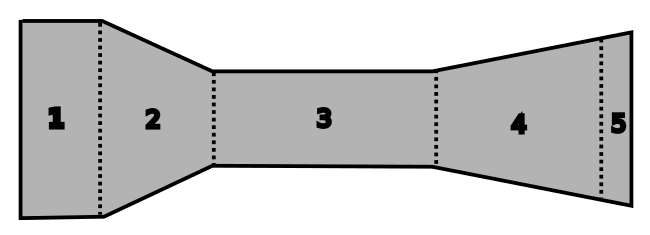

## Preliminary Thoughts
I've worked in the tunnel before professionally and I am confident with utilizing CFD, pressure scanners, and DAQ system, but actually building one from scratch is a bit daunting. 

There are many kinks that must be worked out. As an aerodynamics engineer I am quite comfortable with creating the overall design of the tunnel by using CFD, but the actual fabrication of the tunnel is a daunting task. I've also used pressure scanners many times before, but I've never created one from scratch and I will have to create one from scratch considering how expensive it is to buy off the shelf. I am lucky enough to have been to a wind tunnel to know what is required for the application I have in mind. 

The size of the tunnel as well will be determined by choosing the geometry of the test articles. The project should be done in this order:

1. Determine maximum width, height and length of the test article
2. Test section geometry based on #1
3. Maximum speed of the tunnel
4. Contraction ratio of the nozzle
5. diffuser geometry according to available axial fan
6. What will be measured?
    + air speed
    + surface pressure
    + force
7. DAQ schematic and hardware
8. Fan controller 
9. How will the tunnel be constructed?
10. How to tackle noise and vibration of the fan?

I am sure more will come up as the project moves forward, but for now this is what I have to go off of. 

|Part #|Name|Description|Spec|
|---|---|---|---|
|1| Honey Comb |Reduce turbulence and increases flow uniformity|TBD|
|2| Nozzle |Accelerates flow and conditions flow|6-10 contraction|
|3| Test Section |Test object and instrumentation|30x30x60 cm|
|4| Diffuser|Enables pressure recovery|TBD|
|5| Fan|Draws flow into the tunnel|~2000 cfm or 10 m/s|
## Constraints:
### Test Section
The immediate constraint is space, if I had a ton of real estate. I want the tunnel to fit in a garage so it should not exceed the length of 3 m. The test section will be 30 cm by 30 cm which means a 1:12 scale model can be tested inside. The blockage ratio will be about 17% which is acceptable for me. The test section length should be about 0.5 - 3 times the hydraulic diameter of the test section according to Barlow due to the wake. I will just create the length to be 2 times the diameter, which comes out to 60 cm. 
### Nozzle
The contraction ratio should be between 6-10 and the length of the nozzle has to be approximately the same as the hydraulic diamter of the nozzle inlet according to Mehta. I will conduct some CFD study to figure out the most realistic size for me. Flow uniformity and pressure drop will be monitored. There is also a fifth order polynomial that I can use to determine the shape of the nozzle. 
### Diffuser
Diffuser is there to recover some pressure to reduce resistance. The goal is to keep the flow attached, some simulation I did in the past showed that anything above 6 degrees was quite bad. I will do some more simulation to figure it out. Nozzle length has to be sorted out first for me to be able to design the diffuser. 
### Maximum Speed
A radiator fan will be used to draw the air into the nozzle from the diffuser. The range will be between 10-20 m/s, which means that the fan should move 0.9 - 1.8 cubic meter of air per second or around 2000-4000 cfm. Realistically, the maximum speed of the tunnel will be 10 m/s unless I can design an add-on that contracts the flow even more. The Reynolds number based on the hydraulic diameter of the test section is $1.9\times(10^{5})$. 

