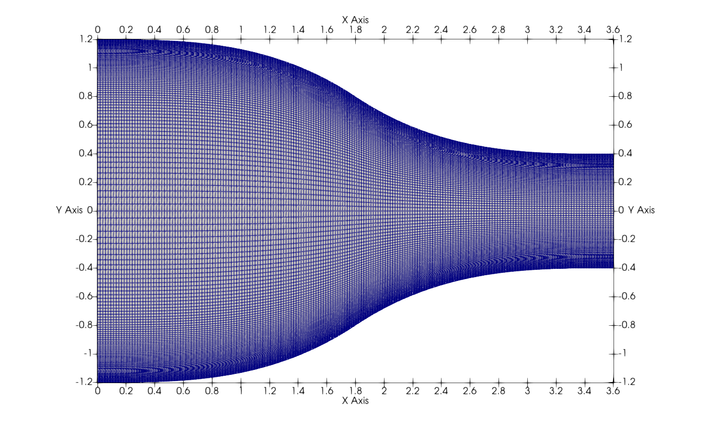
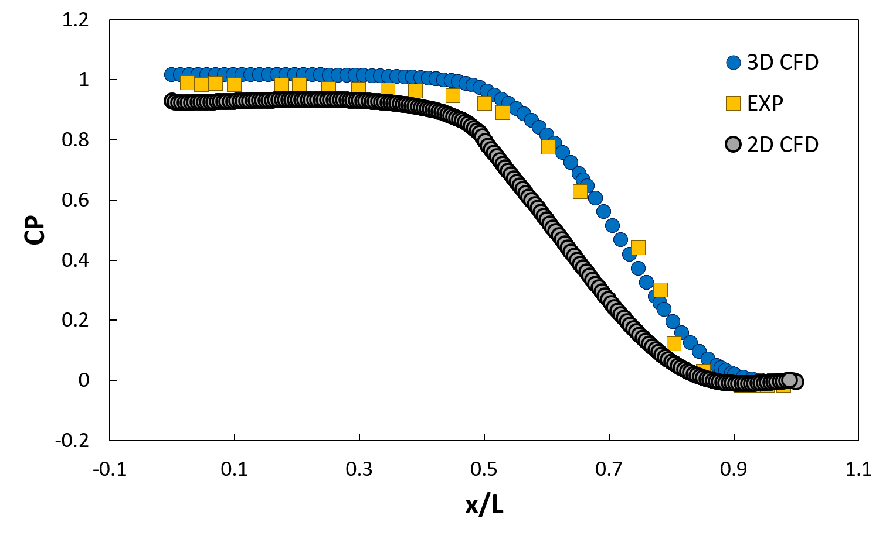
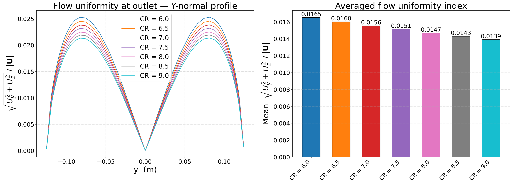
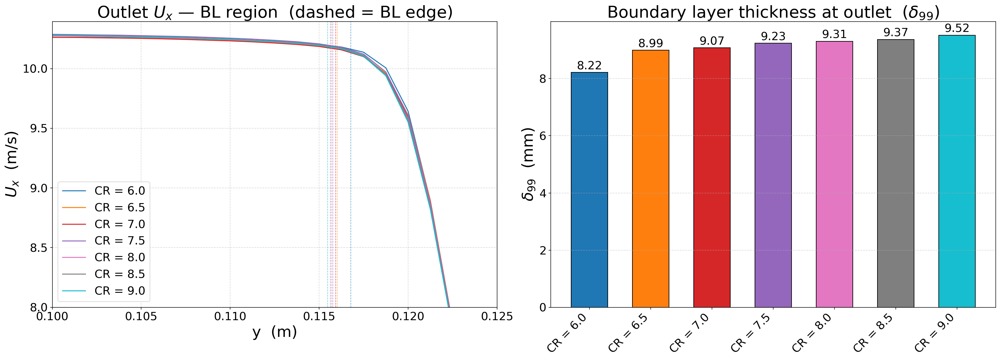
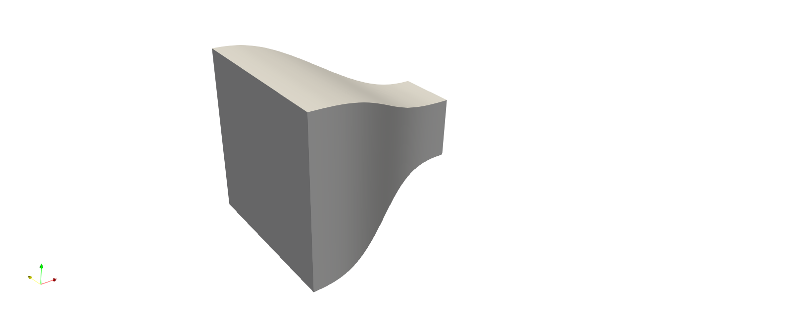

# Overview
The design trade off studies have been completed using OpenFOAM. Pressure drop along the nozzle, boundary layer thickness, and flow uniformity were used to evaluate each designs. Most important consideration is space, the overall length of the tunnel has to be between 2-3 m. Since the test section will be 0.6 m long that means there are 1.4 - 2.4 m of space for both nozzle and diffuser combined. 
The following shows the parameters that has to be determined:
+ Contraction ratio, 6-9
+ Curvature
+ Length; length will be about the size of the inlet of the nozzle
## Preliminary CFD Study
Before the design studies are conducted, I have to determine the numerical model as well as the mesh suitable for the simulation. Because the geometry is rather simple, I will be using blockMesh and validate my simulation setup using an experimental data. This [paper](https://www.sciencedirect.com/science/article/abs/pii/S0167610500000805) by Fang et.al titled "Experimental and analytical evaluation of flow in a square-to-square wind tunnel contraction" provides exactly what I need to make sure my setup is physical. 

Experimental setup: 
+ Contraction ratio of 9
+ Inlet: 2.4 x 2.4 m
+ Outlet: 0.8 x 0.8 m
+ $V_{outlet}$ = 15 m/s
+ $Re$ = 764,000 
+ Surface pressure is measured along the mid plane of each surfaces

The Reynolds number is about 4 times greater, but the flow should behave relatively the same. 

### Numerical Setup
Structured hexahedral mesh is used for this nozzle simulation. OpenFOAM has its own structured mesh generator called blockMesh and it is quite useful when dealing with simple geometries. You can also add curvature via spline command as displayed below. The spline is connecting the vertices 0 and 1 together with prescribed coordinates.  


```cpp
edges(
    spline 0 1
    (
        (x1 y1 z1)
        (x2 y2 z2)
        (x3 y3 z3)
     )
)
```
There is only one block for the nozzle and you can make your block using hex. It helps when you draw out the geometry beforehand with all the vertices labeled. This will help you follow the right-hand rule and I connect the vertices looking down from the z-plane. So the mesh has 200 elements along x direction and 300 in y. I just divided the mesh in two different zones and added half of the elements in each zones. The spacing is 1/500. I think the distance between the cells are determined using the geometric series. 

```cpp
blocks(
    hex (0 1 2 3 4 5 6 7) // 
    (200 300 1)
    simpleGrading( 1 
                    ((5 3 500) (5 3 0.002))   
                    1 )
)
```
<!--
*/
-->

The number of elements in the mesh shown above is 60,000 and it is just here to illustrate the type of mesh that can be generated using blockMesh. I've used ICEM CFD before to make structured mesh and it is quite similar apart from the lack of graphical interface.

I originally wanted to use 2D simulation to save time, but it turns out that is not the right choice. I guess the curvature of the nozzle creates a strong secondary flow inside and creates a flow field that cannot be quite explained using only two coordinates. 


I will conclude that the current setup is adequate for the nozzle design and the same setup will be used later for the diffuser as well. 

## Nozzle Design
Seven simulations have been ran and the parameter of the simulation is summarized below.

<div style="width: fit-content; margin: auto; text-align: center">

| $CR_{Nozzle}$| $W$ & $H$ (m)|$L$ (m)|
|---|---|---|
|6| 0.612 |0.691|
|6.5| 0.637 |0.719|
|7| 0.661  |0.746|
|7.5| 0.685|0.772|
|8| 0.707|0.798|
|8.5| 0.729 |0.822|
|9| 0.750  |0.846|

</div>

Velocity uniformity, boundary layer thickness and pressure drop are used to evaluate the nozzle design. 
<div style="width: fit-content; margin: auto; text-align: center">

| $CR_{Nozzle}$| $\delta P$|BL Thickness (mm)|Flow uniformity|
|---|---|---|---|
|6| 60.70 |8.22|0.0165|
|6.5| 61.02 |8.99|0.0160|
|7| 61.27  |9.07|0.0156|
|7.5| 61.79|9.23|0.0151|
|8| 61.82|9.31|0.0147|
|8.5| 62.06 |9.37|0.0143|
|9| 62.15  |9.52|0.0139|

</div>


### Flow uniformity 


Flow uniformity increases as the contraction ratio goes up. Greater the acceleration, more dominant x-component becomes. The fluid parcel is being stretched more as it experiences higher acceleration which leads to lower vorticiy in general. 

### Boundary Layer Thickness


Boundary layer thickness is highly dependent on the length of the nozzle, which explains the higher boundary layer thickness for high CR cases. 

## Conclusion
Because I want to minimize the overall length of the tunnel, I will choose CR = 7. The angularity of the flow is quite low only 1.6% which is acceptable for me and the boundary layer thickness can be mitigated by installing a testing platform to ensure the object inside only sees a uniform flow. I just have to make sure to install it about 10 mm above the test section. I am not too worry about the power consumption so the difference between CR6 and CR7 is quite negligible. 

The nozzle geometry will be 0.661 x 0.661 x 0.746 m. 

