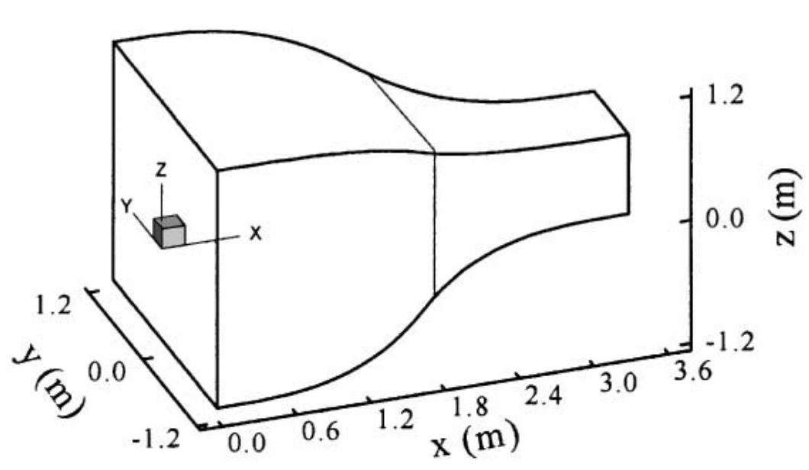

# Overview
The design trade off studies have been completed using OpenFOAM. Pressure drop along the nozzle, boundary layer thickness, and flow uniformity were used to evaluate each designs. Most important consideration is space, the overall length of the tunnel has to be bewteen 2-3 m. Since the test section will be 0.6 m long that means there are 1.4 - 2.4 m of space for both nozzle and diffuser combined. 
The following shows the parameters that has to be determined:
+ Contraction ratio, 6-9
+ Curvature
+ Length; length will be about the size of the inlet of the nozzle
## Preliminary Studies
Before the design studies are conducted, I have to determine the numerical model as well as the mesh suitable for the simulation. Because the geometry is rather simple, I will be using blockMesh and validate my simulation setup using an experimental data. This [paper](https://www.sciencedirect.com/science/article/abs/pii/S0167610500000805) by Fang et.al titled "Experimental and analytical evaluation of flow in a square-to-square wind tunnel contraction" provides exactly what I need to make sure my setup is physical. 

Experimental setup: 
+ Contraction ratio of 9
+ Inlet: 2.4 x 2.4 m
+ Outlet: 0.8 x 0.8 m
+ $V_{outlet}$ = 15 m/s
+ $Re$ = 764,000 
+ Surface pressure is measured along the mid plane of each surfaces

The Reynolds number is about 4 times greater, but the flow should behave relatively the same. 

